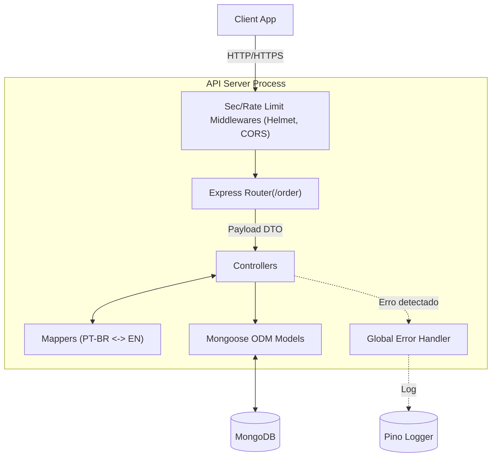

# 🚀 Orders API

<p align="center">
  
  
  
  
</p>

<p align="left">
  <strong>Sua API robusta e segura para gerenciamento de pedidos.</strong><br />
  Crie, liste, atualize e remova pedidos de forma padronizada, rápida e com arquitetura em múltiplas camadas.
</p>

> A Orders API foi totalmente refatorada para transformar operações complexas de e-commerce numa experiência de integração fluida, garantindo tratamento inteligente de erros, proteção de rotas e banco de dados isolado para testes rigorosos.

---

A Orders API é um servidor backend construído com tecnologias modernas de Node.js, concebida para lidar com fluxos de pedidos.

1. **Arquitetura RESTful**: Endpoints desenhados sob convenções REST (`GET /order`, `POST /order`).
2. **Camadas de Adaptação (Mappers)**: Abstrai a estrutura interna do MongoDB, devolvendo apenas os campos formatados em PT-BR para a aplicação cliente.
3. **Validação Inteligente**: Interceptação de dados mal formatados, validação nativa e tratamento para registros duplicados com feedback descritivo.
4. **Resiliência Global**: Middleware centralizado (`errorHandler`) para tratar quebras inesperadas, mantendo o serviço no ar.
5. **Paginação Integrada**: Busca eficiente e segmentada usando os parâmetros padrão `page` e `limit`.
6. **Robustez de Segurança**: Camada protetora embarcada com o pacote **Helmet**, regras de recursos **CORS** e proteção antispam com **Rate Limit**.
7. **Testes Automatizados**: Suite de testes com **Jest**, rodando contra um banco de dados dinâmico de memória (sem sujar o banco principal).
8. **Graceful Shutdown**: Encerramento seguro de conexões ativas do banco quando o servidor recebe os comandos de parada do SO.

---

## Workflow



---

## Built For

- **Arquitetos de Software** gerenciando microsserviços de E-commerce.
- **Desenvolvedores Frontend** que buscam endpoints auto-explicativos e de fácil consumo.
- **DevOps** interessados em aplicações observáveis com logs estruturados (Pino) e tratamento confiável de indisponibilidade de serviços.

---

## Tech Stack

- **Linguagem & Servidor**: Node.js & [Express 5](https://expressjs.com/)
- **Banco de Dados**: [MongoDB](https://www.mongodb.com/) & [Mongoose](https://mongoosejs.com/)
- **Qualidade & Testes**: [Jest](https://jestjs.io/) & [Supertest](https://github.com/ladjs/supertest) c/ MongoDB Memory Server
- **Logger**: [Pino](https://getpino.io/) com saída controlada
- **Proteção e Estabilidade**: Helmet, express-rate-limit

---

## Prerequisites

- **Node.js**: v18 or higher
- **MongoDB**: Instância rodando local ou num cluster em Nuvem (Atlas)
- **Git** (Para clone do repositório)

---

## Setup

### 1. Clonar o Repositório

```bash
git clone https://github.com/devAndreotti/orders-api.git
cd orders-api
```

### 2. Instalar Dependências

```bash
npm install
```

### 3. Variáveis de Ambiente

Crie um arquivo `.env` na raiz do projeto com estas credenciais:

```env
MONGO_URI=mongodb://localhost:27017/orders-api
PORT=3000
LOG_LEVEL=info
```

### 4. Executar em modo desenvolvimento

O projeto utilizará o `--watch` nativo do Node para atualizar automaticamente diante de alterações.

```bash
npm run dev
```

---

## Usage

### ⚙️ Listar Pedidos (Paginado)
Gere relatórios rápidos com respostas em blocos e contagem total do banco.

```bash
curl --location 'http://localhost:3000/order?page=1&limit=10'
```
**Resposta (200 OK):**
```json
{
  "data": [
    {
      "numeroPedido": "v10089015vdb-01",
      "valorTotal": 10000,
      "dataCriacao": "2023-07-19T12:24:11.529Z",
      "items": [
        {
          "idItem": "2434",
          "quantidadeItem": 1,
          "valorItem": 1000
        }
      ]
    }
  ],
  "pagination": {
    "total": 1,
    "page": 1,
    "limit": 10,
    "totalPages": 1
  }
}
```

### ⚙️ Criar Pedido
Cadastre os pedidos repassando a estrutura formatada ao banco de dados pelo Controller.

```bash
curl --location 'http://localhost:3000/order' \
--header 'Content-Type: application/json' \
--data '{
    "numeroPedido": "v10089015vdb-01",
    "valorTotal": 10000,
    "dataCriacao": "2023-07-19T12:24:11.529Z",
    "items": [
        { "idItem": "2434", "quantidadeItem": 1, "valorItem": 1000 }
    ]
}'
```

---

## Testing

A aplicação valida todas as camadas usando testes em memória isolada e requisições montadas, testando cenários de sucesso e duplicidade sem ferir os dados originais. 

Para disparar os testes:
```bash
npm test
```

---

## Project Structure

```text
api-project/
├── src/
│   ├── controllers/      # Lógica de controle de roteamento da API
│   ├── mappers/          # Formatação PT-BR de Retornos para EN de Banco (e vic-versa)
│   ├── middlewares/      # Interceptadores gerais como Error Handling global
│   ├── models/           # Mongoose ODM (Schemas)
│   ├── routes/           # Definição e vínculo dos endpoints HTTP
│   ├── utils/            # Utilitários como logger (Pino)
│   └── app.js            # Arquivo principal inicializador e gerenciador de modulos
├── test/
│   └── order.test.js     # Suítes do Jest e rotinas lógicas de Mocking
├── .env                  # Segredos (não trackeado)
└── package.json          # Dependências
```

---

## Contributing

Ideas and improvements are always welcome! If you enjoy this project, consider contributing code or giving us a star ⭐ on GitHub.

---

## License

This project is licensed under the **ISC License**.

---

<p align="center">
  Made with ☕ by <a href="https://github.com/devAndreotti">Ricardo Andreotti Gonçalves</a>
</p>
